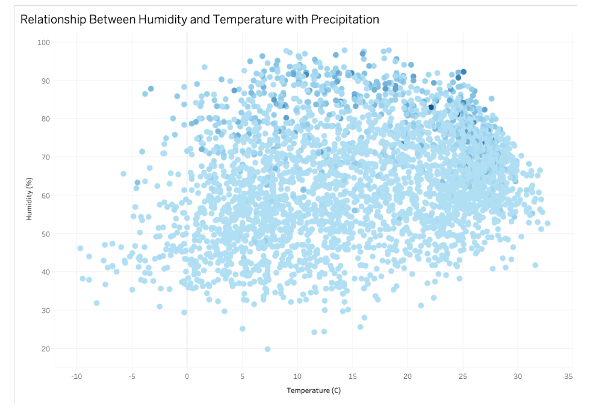
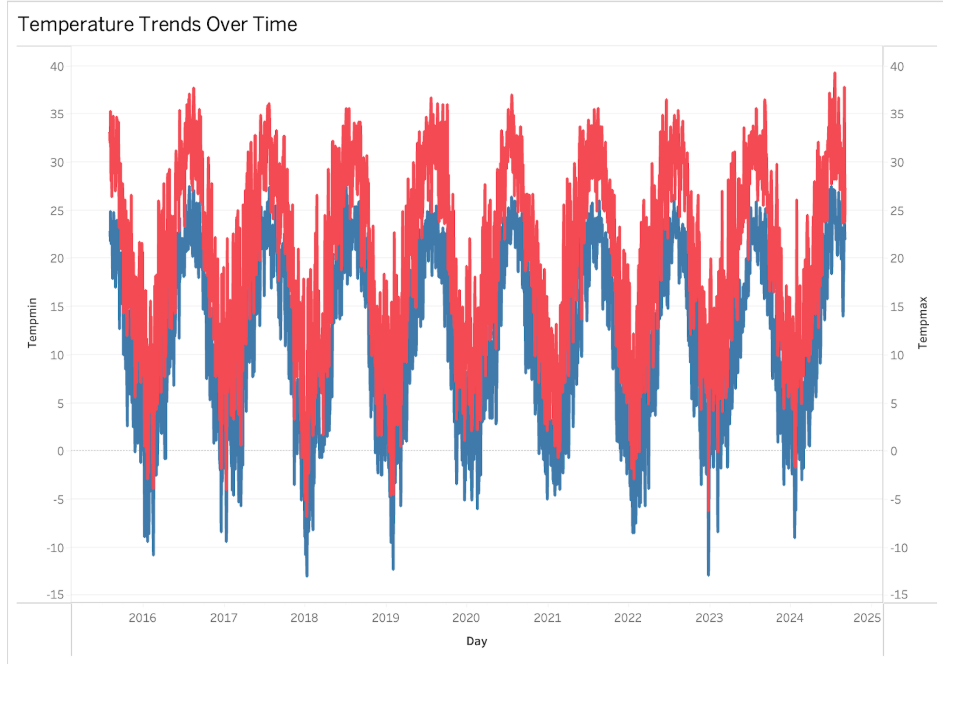

# Predicting Daily Weather Patterns in Washington DC

## Description

### Objective
This project forecasts daily weather metrics such as temperature, precipitation, and humidity using historical data from 2015-2024. Accurate predictions support decision-making in agriculture, energy planning, and public safety.

### Dataset
Sourced from Kaggle, the dataset spans nine years with 33 weather features. Preprocessing ensures quality, handling missing data and encoding categorical fields for machine learning.

### Tools & Technologies
Data Ingestion: Apache Airflow
Data Storage: S3 Bucket
Modeling: Machine Learning
Visualization: Tableau

### Pipeline / Architecture
We are utilizing the Washington DC Historical Weather dataset from Kaggle, which spans 2015-2024 and includes 33 weather features. Our project’s goal is to build a Batch-ML-Visualization pipeline for daily temperature forecasting in Washington, DC.

Data Ingestion: Data is batch-ingested using Apache Airflow, automating regular data pulls and storage in our S3 bucket.
Modeling: We plan to integrate machine learning steps for predicting temperature and, if possible, precipitation.
Visualization: The pipeline concludes with Tableau visualizations, enabling clear comparisons of predicted and observed weather patterns over time.

### Data Quality Assessment
The Washington DC Historical Weather dataset from Kaggle is of overall good quality, sourced from reliable weather stations and maintained by Visual Crossing. Initial inspections reveal that the data is consistent and aligns with expected weather patterns for Washington DC. However, certain fields require cleaning to handle missing or inconsistent values.
The dataset spans nine years (2015-2024) and contains 33 features. While most fields are fully populated, some fields, such as severerisk, have sparse data before 2022. These fields were excluded from the model due to insufficient coverage. The preciptype field contains blanks for days without precipitation. These blanks were converted to 0 (indicating no precipitation).
The dataset was consistent across features with no duplicate rows. Temporal patterns matched expected weather cycles. Columns like sunrise/sunset times and moon phases were removed as they were redundant or irrelevant for predictive purposes.
For the precipitation type field, which contains values such as rain, snow, and ice, we used one-hot encoding to create separate fields for each type. Each new field contains a value of 1 if the type was present and 0 if it was not.
After preprocessing, the dataset was found to be suitable for machine learning tasks. No further significant issues were detected that could impact modeling.

### Data Transformation Models used

Implemented a two-step process involving Feature Extraction and Data Modeling for weather prediction. Raw weather data (2015–2024) was combined, and key features like tempmax, tempmin, humidity, precip, windgust, and year were selected, with temp as the target variable. Data was scaled, split into training and testing sets, and stored in S3. A Gradient Boosting Regressor with 100 boosting stages, a learning rate of 0.1, and a max depth of 3 was trained and evaluated. The model achieved excellent performance, with an MSE of 0.311, MAE of 0.413, and R² of 0.996, indicating high predictive accuracy for weather forecasting
Visualizations:

This scatter plot explores the relationship between temperature (x-axis) and humidity (y-axis). Each dot represents a single day's data point. The intensity of the dot color reflects the amount of precipitation, with darker shades indicating higher precipitation levels. The visualization highlights clusters of high humidity at moderate temperatures and low humidity at extreme temperatures.

This line chart illustrates the minimum and maximum temperatures over time, spanning several years from 2015 to 2025. The red line represents maximum temperatures, while the blue line represents minimum temperatures. The cyclical pattern highlights seasonal variations, with peaks in summer months and troughs in winter months.

## Special Instructions: 
Sign up on Kaggle to access the dataset, ensure required Python dependencies are installed, and upload the dataset to the specified S3 bucket for seamless ingestion.

### Infographic:

### Code: 
https://github.com/umabhargavi20/pythonProject12
### Thorough Investigation

The project effectively combines automated data ingestion, machine learning predictions, and Tableau visualizations to provide weather insights for Washington DC. Its focus on using historical data for accurate predictions supports critical applications i.e. public safety, energy planning, and agriculture.This approach demonstrates strong potential for scalability and real-world impact. Opportunities for growth include expanding to other regions, integrating real-time data streams, and enhancing model accuracy. Transitioning to cloud tools, improving visualization interactivity, and documenting scalability benchmarks will further strengthen its adaptability and usefulness for broader applications.
